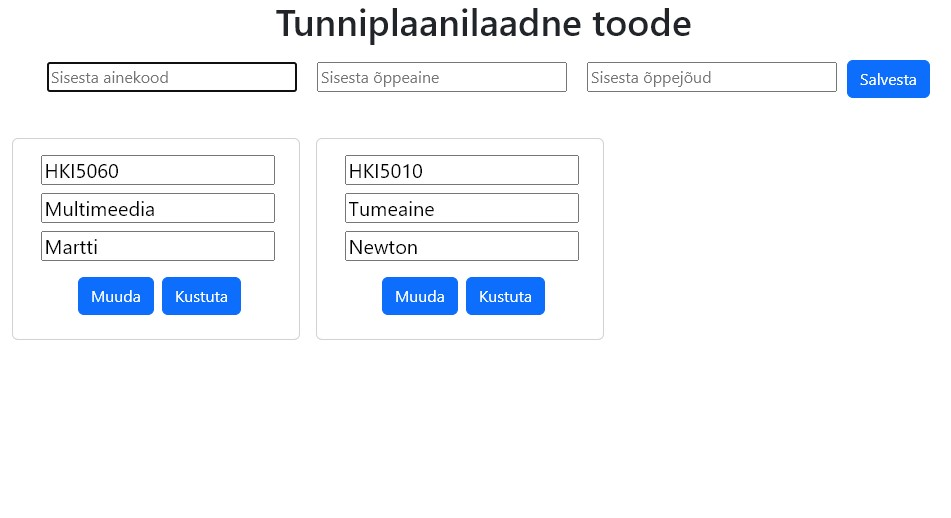

# PRG3-1: React, Node, Express, MySQL 
### Klooni repo

git clone https://github.com/siimsep/PRG3-1.git

### Käivita Dockeris

docker-compose up --build

Rakendus tuleb aadressile: http://localhost:3050/

Saab lisada, midagi muuta, kustutada. Nginx töötab proxy-serverina. 

Axios vahendab Reactist requeste serverile. (https://www.knowledgehut.com/blog/web-development/axios-in-react)

MySQL näeb paremini Adminerist http://localhost:8000/ (server: mysql_db, username: root, password: MYSQL_ROOT_PASSWORD)

 
